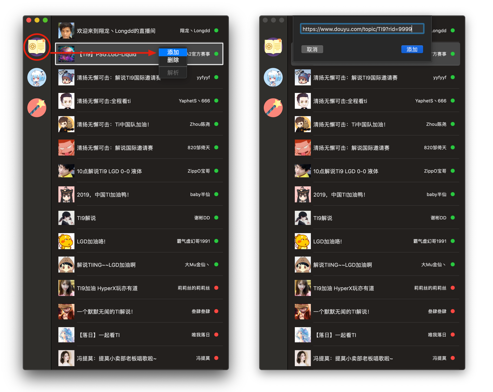
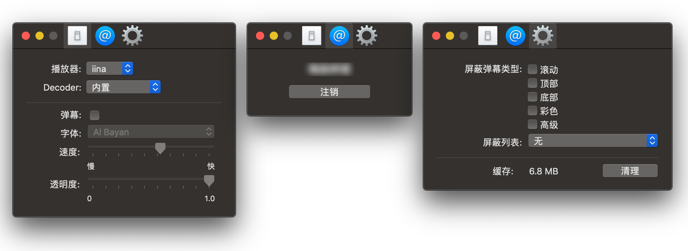

# 使用 IINA+ 在 IINA 播放器上观看直播
### 播放效果
* 左侧是IINA+。
* 右侧是IINA播放效果（排版独立，支持同时播放多个直播）。

---
### 添加链接
* 点击左上角「书本」图标，在右侧鼠标右击「添加」。
* 把直播地址粘贴到框内，点击添加即可。`🟢直播 🔴未直播`
* 左侧第二个图标是哔哩哔哩。

---
### 基本设置

---
### 优点
* 不需要打开多个平台网页，没有乱七八糟的页面广告。
* 自动选择最高清晰度。
* 支持斗鱼、虎牙、企鹅电竞、哔哩哔哩、YouTube等。
* 支持多个直播同时打开。
* 调节某一个音量大小不影响其他直播音量。

---
### 软件下载
* [IINA播放器](https://www.iina.io/)
* [IINA+](https://github.com/xjbeta/iina-plus/releases)

本文参考自：https://github.com/xjbeta/iina-plus
